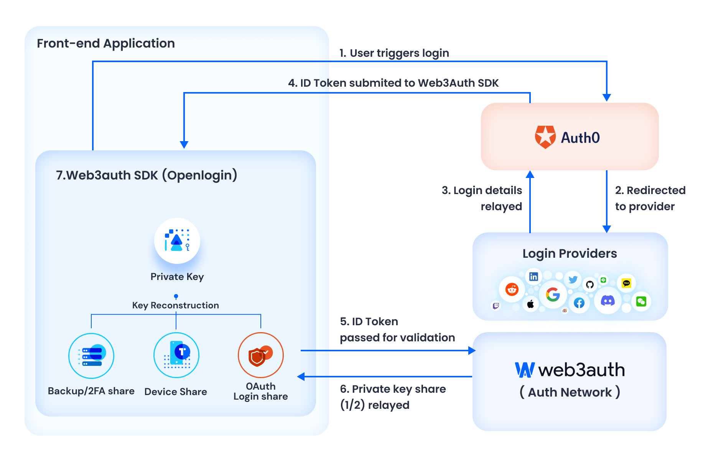
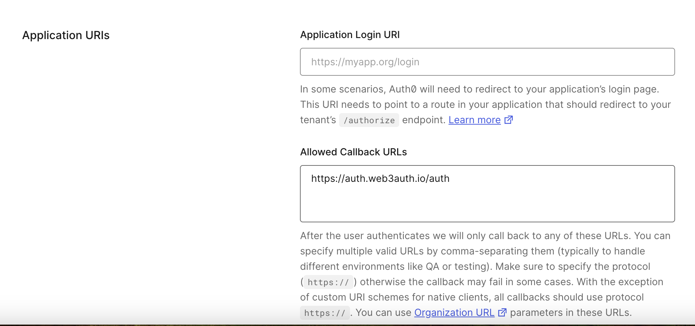
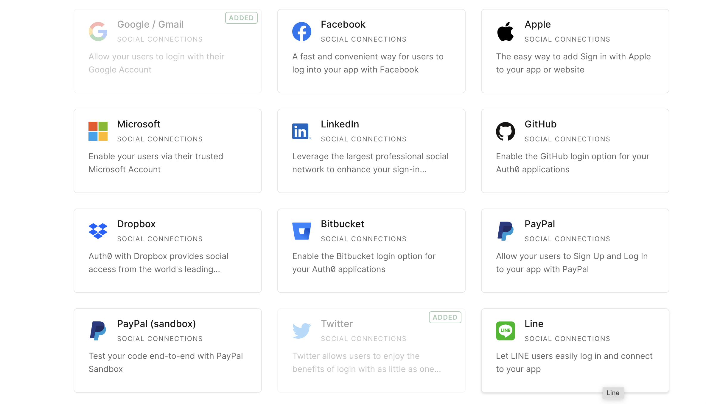
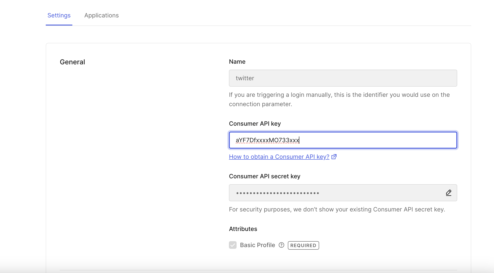
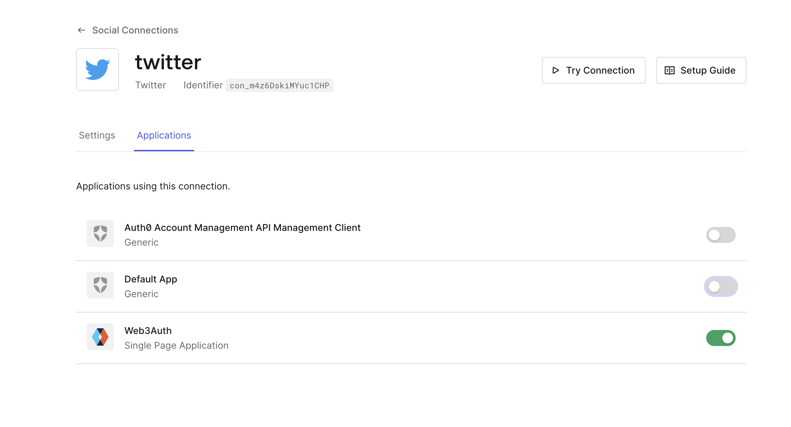
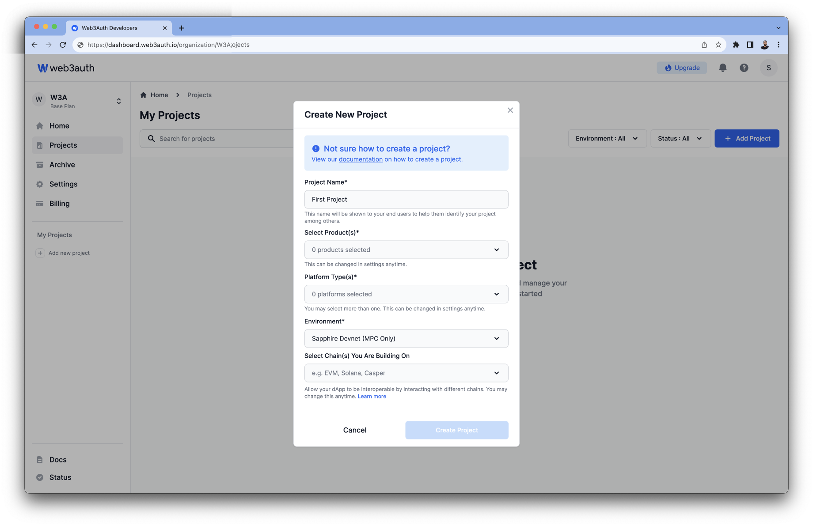
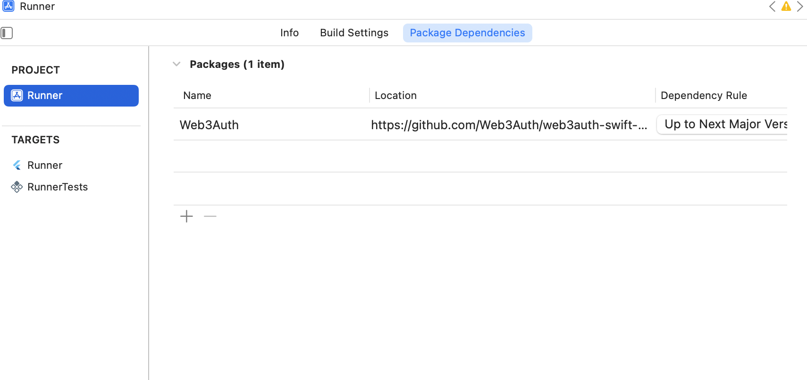

<h2> Web3Auth with Solana </h2>

This guide will talk about using Web3Auth SDK in Flutter, and integrating Solana chain to fetch user account, balance, sign transaction, and broadcast a transaction. For this guide we'll be using Web3Auth social login with Custom Authentication. For custom authenticaton we'll be using Auth0 Single Page Applications (SPA) flow. 

<h4>Overview of login flow </h4>

When integration Web3Auth with Auth0 SPA, the flow looks like:


- When user logs in with Auth0 twitter provider, Auth0 sends a JWT `id_token` to the app. This JWT token is sent to the Web3Auth SDK's login function.

- On successful validation of JWT token, Web3Auth SDK will generate a private key for the user, in a self-custodial way, resulting in easy onboarding for your user to the application. 

<h4> Prerequisites </h4>

- Web3Auth account. [Create Web3AuthAccount](https://dashboard.web3auth.io/login)
- [Auth0 tenant](https://auth0.com/signup?place=header&type=button&text=sign%20up) with Single Page Web Application configuration
- Twitter developer account. [Create twitter developer account](https://developer.twitter.com/en/portal/dashboard)
- Android API version 24 or higher.
- iOS 14+

<h3> Setup </h3>

Before we dive into code, let's quickly go through setup.

<h4> Setup Auth0 tenant </h4>

- Create a new tenant from Auth0 dashboard.


- After creating a tenant, add the following URLs for your app to the `Allowed Callback Urls` field when configuring the Auth0 application.
`https://auth.web3auth.io/auth`




<h4> Enable Social Login </h4>
Once you have setup your tenant and new application, we are going to enable twitter authentication.

- Enable the Twitter provider in the authentication page of your tenant.


- Once enabled, add your Consumer API Key and Consumer API Key Sceret. You can get the key and secret from [twitter developer account](https://developer.twitter.com/en/portal/dashboard).


- After adding your keys, enable the twitter provider for your Auth0 application.


<h4> Setup Web3Auth Dashboard </h4>

- Create a new project from Project section of Web3Auth Developer Dashboard.


- Enter the details of your project. For this guide, we are going to use the `Plug n Play` product. For the platform type, please select `Flutter`.

- For the developement purpose we are going to use the `Sapphire Devnet` network. For the production purpose, make sure to convert your project to
`Saphire Mainent` or any of the legacy mainnet networks. 

- You can select the supported blockchains for your project. For this guide, we will be selecting `Solana`.

- Once you have created the project, please whitelist the domains where your project will be hosted.

- Add {SCHEME}:\//{YOUR_APP_PACKAGE_NAME} (e.g, demo:\//com.example.web3_auth_solana/auth) for Android and {bundleId}\://auth (e.g, com.example.web3authsolana://auth) for iOS in the Whitelist URL field of the Web3Auth Dashboard. Make sure that domain is in the lowercase.

<h4> Create Auth0 Verifiers </h4>

- Create a verifier from the Custom Authentication section of your project in Web3Auth's developer dashboard with the following configuration.
  
   - Choose a name of your choice for the verifier identifier. eg ppp-auth0-twitter
   - Select Auth0 as the Login Provider and Twitter to be Auth Provider.
   - Paste the Cliend ID and Auth0 Domain from the Auth0 SPA you created in the above steps.This will be used to validate the JWT token issued by Auth0.
   - Click on the Create button to create your verifier. It may take up to 10-20 minutes to deploy the verifier on Sapphire Devnet.


<h3> Using Web3Auth SDK </h3>
To use the Web3Auth SDK, you need to add the dependency of the respective platform SDK of Web3Auth to your project. For this guide, we will be using the [Web3Auth Flutter SDK](https://pub.dev/packages/web3auth_flutter).

<h4> Installation </h4>

To install Web3Auth SDK, you can either use command line or add dependency in `pubspec.yaml`.

```yaml
dependencies:
  web3auth_flutter: ^3.1.1
```
OR

```bash
flutter pub add web3auth_flutter
```

<h4> Android </h4>

<h6> Add Web3Auth to Gradle</h6>

In your project-level's build.gradle file, add JitPack repository

```
allprojects {
    repositories {
        google()
        mavenCentral()
        maven { url "https://jitpack.io" }
    }
}
```

<h6> Permissions </h6>

Add `INTERNET` permission to your `AndroidManifest.xml` file. Make sure `<uses-permission>` element must be a direct child of the `<manifest>` root element

```xml
<uses-permission android:name="android.permission.INTERNET" />
```

<h6> Configure Plug n Play product </h6>

Add {SCHEME}:\//{YOUR_APP_PACKAGE_NAME} to Whitelist URLs. eg. demo:\//com.example.web3_auth_solana/auth. 

<h6> Configure Deep Link </h6>
Open AndroidManifest.xml file and add the following deep link intent filter to your main activity.

```xml
<intent-filter>
  <action android:name="android.intent.action.VIEW" />

  <category android:name="android.intent.category.DEFAULT" />
  <category android:name="android.intent.category.BROWSABLE" />

  <data android:scheme="{scheme}" android:host="{YOUR_APP_PACKAGE_NAME}" android:path="/auth" />
  <!-- Accept URIs: demo://com.example.web3_auth_solana/auth -->
</intent-filter>
```

Make sure your main activity launchMode is set to singleTop in your AndroidManifest.xml.

```xml
<activity
  android:launchMode="singleTop"
  android:name=".YourActivity">
  // ...
</activity>
```

<h4> iOS <h4>

<h6> Dependency </h6>

If you are using the Swift Package Manager (SPM), add the Web3Auth in the package dependency. In the choose package prompt add the following url.
`https://github.com/Web3Auth/web3auth-swift-sdk`



If you are using the Cocoapods, add `Web3Auth` in the iOS Podfile.
`pod 'Web3Auth', '~> 7.4.0'`

<h6> Configuration </h6>

Whitelist {bundleId}:\//auth eg. ccom.example.web3authsolana://auth in the developer dashboard. This step is mandatory for the redirect to work.

<h3> Initialization </h3>

After installation, the next steop it to use initialize the Web3AuthSDK. This can be achieved by using the `init` method.

Please note that these are the most critical steps where you need to pass on different parameters according to the preference of your project. Additionally, Whitelabeling and Custom Authentication have to be configured within this step.

<h4> Create Web3Auth Instance </h4>

In your main.dart file, initialise the Web3AuthFlutter plugin in the main function.

```dart
Future<void> main() async {
  WidgetsFlutterBinding.ensureInitialized();
  ServiceLocator.init();
  final Uri redirectUrl;
  if (Platform.isAndroid) {
    redirectUrl = Uri.parse('{SCHEME}://{HOST}/auth');
    // demo://com.example.web3_auth_solana/auth
  } else {
     redirectUrl = Uri.parse('{bundleId}://auth');
    // com.example.web3authsolana://auth
  }

  final loginConfig = HashMap<String, LoginConfigItem>();
  loginConfig['twitter'] = LoginConfigItem(
    verifier: "Your custom authentication verifier",
    // ppp-auth0-twitter
    typeOfLogin: TypeOfLogin.twitter,
    clientId: "Your clientId from Auth0 application",
  );

  await Web3AuthFlutter.init(
    Web3AuthOptions(
      clientId: "YOUR ClIENT ID FROM DASHBOARD",
      network: Network.sapphire_devnet,
      redirectUrl: redirectUrl,
      /// loginConfig is used for custom authentication with Auth0
      loginConfig: loginConfig,
      whiteLabel: WhiteLabelData(
        appName: "Solana Web3Auth Flutter",
        mode: ThemeModes.dark,
        useLogoLoader: true,
      ),
    ),
  );

  await Web3AuthFlutter.initialize();

  runApp(const MainApp());
}
```

<h3> Authentication </h3>

After initializing the SDK, the next step is to write a method to authenticate when user clicks on login button. Upon successful login, we'll navigate to `HomeScreen`.

<h4> Login </h4>

```dart
class LoginPage extends StatelessWidget {
  const LoginPage({super.key});

  @override
  Widget build(BuildContext context) {
    return Scaffold(
      body: Center(
        child: OutlinedButton(
          onPressed: () => login(context),
          child: const Text("Login with Twitter"),
        ),
      ),
    );
  }

  Future<void> login(BuildContext context) async {
    try {
      await Web3AuthFlutter.login(
        LoginParams(
          loginProvider: Provider.twitter,
          // You can configure the MFA authentication by choosing one of
          // the enum value.
          mfaLevel: MFALevel.NONE,
          extraLoginOptions: ExtraLoginOptions(
            domain: "Your Auth0 domain",
            // https://solana-web3auth.us.auth0.com
          ),
        ),
      );

      if (context.mounted) {
        /// Navigate to HomeScreen after successful login.
        Navigator.of(context).pushReplacement(
          MaterialPageRoute(builder: (context) {
            return const HomeScreen();
          }),
        );
      }
    } catch (e, _) {
      if (context.mounted) {
        showInfoDialog(context, e.toString());
      }
    }
  }
}

```

When connecting, the login function takes the LoginParams arguments for the login. See the LoginParams for more details.

<h4> Sample Login Response </h4>

```json
{
  "privKey": "0ajjsdsd....",
  "userInfo": {
    "email": "w3a-heroes@web3auth.com",
    "name": "Web3Auth Heroes",
    "profileImage": "https://lh3.googleusercontent.com/a/Ajjjsdsmdjmnm...",
    "verifier": "torus",
    "verifierId": "w3a-heroes@web3auth.com",
    "typeOfLogin": "google",
    "aggregateVerifier": "w3a-google-sapphire",
    "dappShare": "", // 24 words of seed phrase will be sent only incase of custom verifiers
    "idToken": "<jwtToken issued by Web3Auth>",
    "oAuthIdToken": "<jwtToken issued by OAuth Provider>", // will be sent only incase of custom verifiers
    "oAuthAccessToken": "<accessToken issued by OAuth Provider>", // will be sent only incase of custom verifiers
    "isMfaEnabled": false // Returns whether the user has enabled MFA or not
  },
  "ed25519PrivKey": "666523652352635....",
  "coreKitKey": "0xajjsdsd....",
  "coreKitEd25519PrivKey": "666523652352635....",
  "sessionId": "0xajjsdsd...."
}
```

<h4> Private Key </h4>
For the Solana chain, we'll be retriving the ed25519 private key. The ed25519 returns the keypair, from which we can use the first 32 byte for the private key.

```dart
final privateKey = await Web3AuthFlutter.getEd25519PrivKey();
```

<h4> Logout </h4>

Loggin out your user from the application is as easy as calling the `Web3AuthFlutter.logOut()` function. Upon successful logout, we'll redirect user to login page.

```dart
/// For the full code, checkout lib -> home_screen.dart
Future<void> logOut(BuildContext context) async {
    showLoader(context);

    try {
      await Web3AuthFlutter.logout();
      if (context.mounted) {
        Navigator.of(context).pushReplacement(
          MaterialPageRoute(builder: (context) {
            return const LoginPage();
          }),
        );
      }
    } catch (e, _) {
      if (context.mounted) {
        removeDialog(context);
        showInfoDialog(context, e.toString());
      }
    }
  }
```

<h3> Interacting with Solana </h3>

To interact with Solana, we are going to use the [solana package](https://pub.dev/packages/solana). 

<h4> Solana Provider </h4>

To use the Solana RPC, we'll make a provider class which will help us interact with Solana. The class will help us to retive balance, and also transfer SOL to another account.

```dart
import 'dart:math';

import 'package:solana/solana.dart';

const int tokenDecimals = 9;

class SolanaProvider {
  final SolanaClient solanaClient;

  SolanaProvider(this.solanaClient);

  Future<double> getBalance(String address) async {
    final balanceResponse = await solanaClient.rpcClient.getBalance(
      address,
    );

    /// We are dividing the balance by 10^9, because Solana's
    /// token decimals is set to be 9;
    return balanceResponse.value / pow(10, tokenDecimals);
  }

  Future<String> sendSol({
    required Ed25519HDKeyPair keyPair,
    required String destination,
    required double value,
  }) async {
 
    /// Converting user input to the lamports, which are smallest value
    /// in Solana.
    final num lamports = value * pow(10, tokenDecimals);
    final transactionHash = await solanaClient.transferLamports(
      source: keyPair,
      destination: Ed25519HDPublicKey.fromBase58(destination),
      lamports: lamports.toInt(),
    );

    return transactionHash;
  }
}

```

<h4> Load Account </h4>

In this step, we'll fetch the account from user's private key and use `SolanaProvider` to fetch user balance.

```dart
/// To view full code checkout lib -> home_screen.dart
Future<void> loadAccount(BuildContext context) async {
    try {
      final privateKey = await Web3AuthFlutter.getEd25519PrivKey();

      /// The ED25519 PrivateKey returns a key pair from
      /// which we only require first 32 byte.
      keyPair = await Ed25519HDKeyPair.fromPrivateKeyBytes(
        privateKey: privateKey.hexToBytes.take(32).toList(),
      );
      balance = await provider.getBalance(keyPair.address);
      isAccountLoaded.value = true;
    } catch (e, _) {
      if (context.mounted) {
        showInfoDialog(context, e.toString());
      }
    }
  }
```

<h4> Send Transaction </h4>

For transfering the SOL, we are going to use the `SolanaProvider`. Upon successfully broadcasting the transaction, we'll show the transaction hash to user and refresh the balance. In this guide, we'll do self transfer, but you can choose the destination address of your choice.

```dart
/// To view full code checkout lib -> home_screen.dart
Future<void> selfTransfer(BuildContext context) async {
    showLoader(context);
    try {
      final hash = await provider.sendSol(
        destination: keyPair.address,
        keyPair: keyPair,
        value: 0.0001,
      );
      if (context.mounted) {
        removeDialog(context);
        showInfoDialog(context, "Success: $hash");
        refreshBalance(context);
      }
    } catch (e, _) {
      if (context.mounted) {
        removeDialog(context);
        showInfoDialog(context, e.toString());
      }
    }
  }
```

<h3> Example Code </h3>

To run the example code, clone the repo, check it out and try running it locally yourself! To run the code use `flutter run`.

<h3> Demo </h3>

Here's a demo of the sample. 


https://github.com/AyushBherwani1998/web3auth_solana/assets/34301187/b0568531-f891-433b-bc51-26438cf0bb58


